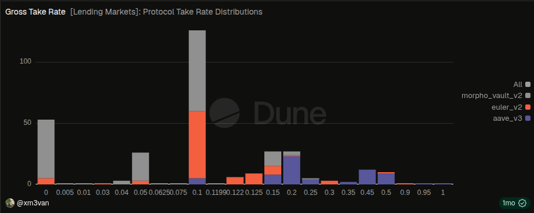

## Summary

Increase the LlamaLend V2 market admin fees on Optimism from 1% to 10%.

## Abstract

After an initial period of market bootstrapping and testing, the new LlamaLend V2 markets on Optimism appear to be functioning as intended. This proposal seeks to increase the admin fee from the temporary 1% launch value to 10%, bringing the markets in line with common industry practice while having only a minimal impact on supplier yields.

## Motivation

When the three new LlamaLend V2 markets were activated on Optimism, they were configured with a conservative 1% admin fee during the initial testing phase (see rationale here: [LlamaRisk - Activating the First LlamaLend v2 Markets on Optimism: Borrow Caps & Admin Fee](https://gov.curve.finance/t/activating-the-first-llamalend-v2-markets-on-optimism-borrow-caps-admin-fee/11097)).

Following launch last week, the markets appear to be functioning as expected with the current configuration. As such, it is appropriate to transition from the temporary launch fee to a more typical long-term fee structure.

Increasing the admin fee increases protocol revenue earned by Curve DAO while only marginally reducing supplier returns. Thanks to @xm3van from LlamaRisk, we can see that an admin fee of 10% is common across the lending industry:

As these markets are currently heavily incentivized with OP tokens, the impact on suppliers is expected to remain minimal. At the time of writing, suppliers would receive approximately 0.1 percentage points less yield on average:

| Market                                                                                                    | Current Supplier Net APY | Supplier Net APY After |
| --------------------------------------------------------------------------------------------------------- | ------------------------ | ---------------------- |
| [wstETH/USDC](https://www.curve.finance/lend/optimism/markets/0xb5EC7A3D591877A66BE4f3eafdC4205E98A1BCAA) | 8.19%                    | 8.06%                  |
| [WBTC/USDC](https://www.curve.finance/lend/optimism/markets/0x9fC15ac3EF97093832f49B7997A58E29b49C56dE)   | 8.02%                    | 7.88%                  |
| [wstETH/WETH](https://www.curve.finance/lend/optimism/markets/0x745422BF49f3F6e4A8E12E4abD19339E7910F8C9) | 4.90%                    | 4.86%                  |

## Specification

The following market parameters are proposed to change:

| Market                                                                                                    | Current Admin Fee | Proposed Admin Fee |
| --------------------------------------------------------------------------------------------------------- | ----------------- | ------------------ |
| [wstETH/USDC](https://www.curve.finance/lend/optimism/markets/0xb5EC7A3D591877A66BE4f3eafdC4205E98A1BCAA) | 1%                | 10%                |
| [WBTC/USDC](https://www.curve.finance/lend/optimism/markets/0x9fC15ac3EF97093832f49B7997A58E29b49C56dE)   | 1%                | 10%                |
| [wstETH/WETH](https://www.curve.finance/lend/optimism/markets/0x745422BF49f3F6e4A8E12E4abD19339E7910F8C9) | 1%                | 10%                |

These parameters would be changed by calling Optimism's LlamaLend Configurator and setting the `admin_percentage` parameter to `1e17` (10%, where `1e18 = 100%`) for each of the three market controllers listed above.